# BÁO CÁO DỰ ÁN: CASIO VN STORE

## Web app thương mại điện tử bán đồng hồ Casio

**Môn học:** Phát triển giao diện ứng dụng<br>
**Nền tảng:** Next.js App Router, React, TypeScript<br>
**Ngày cập nhật:** 14/05/2026

---

## MỤC LỤC

1. [Giới thiệu tổng quan](#1-giới-thiệu-tổng-quan)
2. [Kiến trúc hệ thống](#2-kiến-trúc-hệ-thống)
3. [Công nghệ sử dụng](#3-công-nghệ-sử-dụng)
4. [Mô hình dữ liệu](#4-mô-hình-dữ-liệu)
5. [Luồng dữ liệu và nghiệp vụ](#5-luồng-dữ-liệu-và-nghiệp-vụ)
6. [Các chức năng chính](#6-các-chức-năng-chính)
7. [Cấu trúc thư mục dự án](#7-cấu-trúc-thư-mục-dự-án)
8. [Bảo mật và phân quyền](#8-bảo-mật-và-phân-quyền)
9. [Kiểm thử, CI/CD và triển khai](#9-kiểm-thử-cicd-và-triển-khai)
10. [Đối chiếu yêu cầu và tổng kết](#10-đối-chiếu-yêu-cầu-và-tổng-kết)

---

## 1. Giới thiệu tổng quan

**Casio VN Store** là web app thương mại điện tử phục vụ nhu cầu xem, tìm kiếm và mua đồng hồ Casio chính hãng tại Việt Nam. Hệ thống có hai nhóm người dùng chính:

- **Khách hàng/User:** xem danh mục, tìm kiếm, lọc sản phẩm, thêm vào giỏ hàng, yêu thích sản phẩm, thanh toán, xem hồ sơ và lịch sử đơn hàng.
- **Quản trị viên/Admin:** theo dõi dashboard, quản lý sản phẩm, quản lý đơn hàng, quản lý người dùng và hỗ trợ vận hành cửa hàng.

Dự án ban đầu là giao diện SPA và đã được nâng cấp sang **Next.js 15 App Router** để đáp ứng yêu cầu môn học về routing, SSR/SSG/ISR, API Routes, metadata, auth, testing và CI/CD.

### 1.1 Mục tiêu sản phẩm

- Xây dựng một web app thương mại điện tử chạy được trên môi trường deploy.
- Tổ chức repo rõ ràng, có tài liệu kỹ thuật, API spec, schema và sprint report.
- Bổ sung backend nhẹ bằng Next.js Route Handlers để mô phỏng các nghiệp vụ auth, products, orders, users và AI.
- Đảm bảo có luồng phân quyền `admin` / `user`, refresh token hoặc re-login flow.
- Có test coverage tối thiểu gồm unit/component tests và integration flows.

### 1.2 Phạm vi nghiệp vụ

| Nhóm chức năng   | Mô tả                                                                  |
| ---------------- | ---------------------------------------------------------------------- |
| Catalog          | Danh sách sản phẩm, chi tiết sản phẩm, danh mục G-Shock/Edifice/Baby-G |
| Search và filter | Tìm theo keyword, lọc theo danh mục, giá, bộ máy, giới tính, tồn kho   |
| Cart và checkout | Giỏ hàng, tổng tiền, thông tin giao hàng, tạo đơn hàng demo            |
| Account          | Đăng ký, đăng nhập, đăng xuất, profile, wishlist                       |
| Admin            | Dashboard, CRUD products, orders, users                                |
| AI hỗ trợ        | Gợi ý sản phẩm, tạo nội dung sản phẩm, phân tích dashboard             |
| SEO              | Metadata per page, canonical, Open Graph, sitemap                      |

---

## 2. Kiến trúc hệ thống

### 2.1 Sơ đồ kiến trúc tổng thể

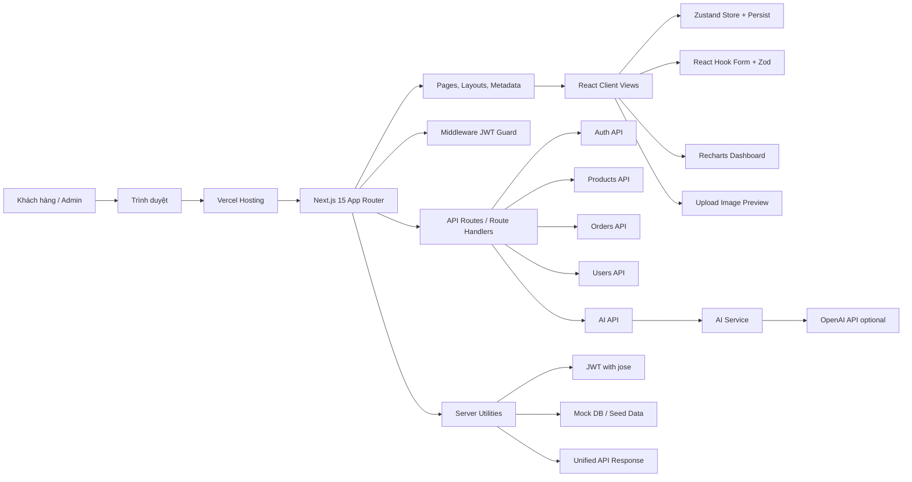

Kiến trúc hiện tại theo hướng **full-stack nhẹ trong Next.js**. Frontend, routing, API và middleware cùng nằm trong một ứng dụng Next.js để dễ deploy trên Vercel. Dữ liệu hiện dùng seed/mock DB phục vụ demo; khi triển khai production thật có thể thay lớp `mockDb` bằng Prisma/PostgreSQL mà không cần thay đổi lớn ở giao diện.

### 2.2 Kiến trúc phân lớp

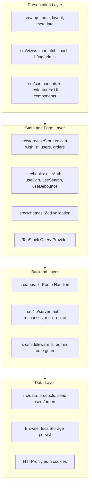

### 2.3 Kiến trúc routing Next.js App Router

```mermaid
flowchart TB
  root["src/app/layout.tsx<br/>Root layout + metadata + AppShell"] --> publicPages["Public pages"]
  root --> shopPages["Shop pages"]
  root --> accountPages["Account pages"]
  root --> adminPages["Admin pages"]
  root --> apiRoutes["API routes"]

  publicPages --> home["/"]
  publicPages --> login["/login"]
  publicPages --> register["/register"]
  publicPages --> policies["/shipping-policy<br/>/return-policy<br/>/warranty-policy<br/>/privacy-policy"]

  shopPages --> shop["/shop"]
  shopPages --> productDetail["/product/[id]<br/>SSG/ISR + dynamic metadata"]
  shopPages --> cart["/cart"]
  shopPages --> wishlist["/wishlist"]
  shopPages --> checkout["/checkout<br/>dynamic SSR"]

  accountPages --> profile["/profile<br/>dynamic SSR"]

  adminPages --> adminHome["/admin<br/>dynamic SSR"]
  adminPages --> adminProducts["/admin/products<br/>dynamic SSR"]
  adminPages --> adminOrders["/admin/orders<br/>dynamic SSR"]
  adminPages --> adminUsers["/admin/users<br/>dynamic SSR"]

  apiRoutes --> authRoutes["/api/auth/*"]
  apiRoutes --> productRoutes["/api/products/*"]
  apiRoutes --> orderRoutes["/api/orders/*"]
  apiRoutes --> userRoutes["/api/users/*"]
  apiRoutes --> aiRoutes["/api/ai/*"]
```

### 2.4 Chiến lược render

| Loại render       | Route tiêu biểu                                   | Mục đích                                                     |
| ----------------- | ------------------------------------------------- | ------------------------------------------------------------ |
| Static            | `/`, `/shop`, `/cart`, `/wishlist`, policy pages  | Tốc độ tải nhanh, phù hợp nội dung ít phụ thuộc request      |
| Dynamic SSR       | `/admin/*`, `/profile`, `/checkout`               | Không cache tĩnh vì phụ thuộc trạng thái người dùng/admin    |
| SSG/ISR           | `/product/[id]`                                   | Pre-render chi tiết sản phẩm, revalidate theo chu kỳ         |
| API runtime       | `/api/auth/*`, `/api/products/*`, `/api/orders/*` | Backend nhẹ trong cùng codebase Next.js                      |
| Metadata per page | Các trang chính và product detail                 | SEO, title/description/canonical/Open Graph rõ theo từng URL |

---

## 3. Công nghệ sử dụng

### 3.1 Frontend

| Công nghệ       | Phiên bản trong dự án | Vai trò                                         |
| --------------- | --------------------- | ----------------------------------------------- |
| Next.js         | 15.x                  | App Router, SSR/SSG/ISR, API Routes, metadata   |
| React           | 19.x                  | Xây dựng UI component                           |
| TypeScript      | 6.x                   | Type-safe cho component, store, API type        |
| Tailwind CSS    | 4.x                   | Styling theo utility class                      |
| Zustand         | 5.x                   | Global state cho cart, wishlist, orders, users  |
| TanStack Query  | 5.x                   | Query provider, sẵn sàng mở rộng server state   |
| React Hook Form | 7.x                   | Quản lý form đăng nhập, đăng ký, checkout, CRUD |
| Zod             | 4.x                   | Validate schema input                           |
| Recharts        | 3.x                   | Biểu đồ doanh thu/dashboard                     |
| Lucide React    | 1.x                   | Icon UI                                         |

### 3.2 Backend nhẹ trong Next.js

| Thành phần                 | Vai trò                                                          |
| -------------------------- | ---------------------------------------------------------------- |
| Route Handlers             | API cho auth, products, orders, users, AI                        |
| Middleware                 | Chặn route admin bằng JWT role                                   |
| `jose`                     | Ký và verify JWT access/refresh token                            |
| `src/lib/server/mock-db`   | Lớp dữ liệu in-memory mô phỏng database                          |
| `src/lib/server/responses` | Chuẩn hóa response `{ success, data }` và `{ success, message }` |
| AI service                 | Gọi OpenAI khi có API key, fallback nội bộ khi chưa cấu hình     |

### 3.3 Công cụ chất lượng

| Công cụ                 | Vai trò                             |
| ----------------------- | ----------------------------------- |
| ESLint                  | Kiểm tra lỗi code và quy ước cơ bản |
| Prettier                | Format code/Markdown                |
| Husky + lint-staged     | Pre-commit format/lint file staged  |
| Jest                    | Unit test, component test           |
| React Testing Library   | Test hành vi UI và integration flow |
| TypeScript `--noEmit`   | Kiểm tra type trước khi build       |
| GitHub Actions + Vercel | CI/build check và deploy            |

---

## 4. Mô hình dữ liệu

Dữ liệu hiện tại được seed trong code để phục vụ demo giao diện. Thiết kế entity được tổ chức theo mô hình thương mại điện tử cơ bản, có thể chuyển sang database thật trong giai đoạn sau.

### 4.1 ERD tổng quan

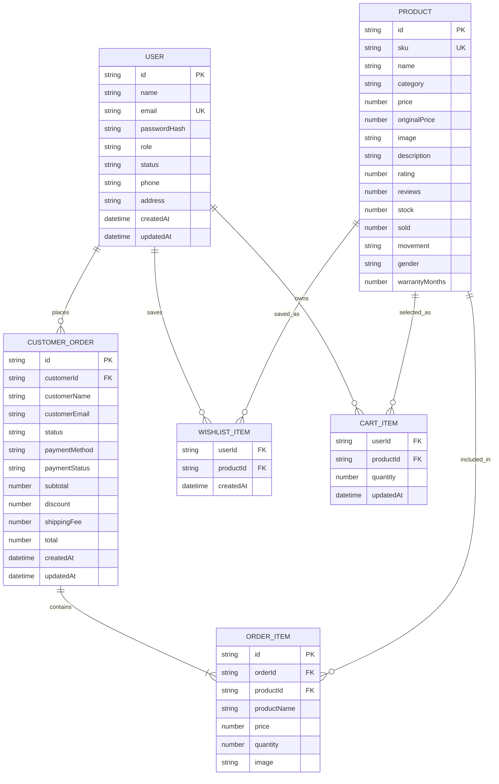

### 4.2 Mô tả các entity chính

| Entity           | Mục đích                                           | File liên quan                               |
| ---------------- | -------------------------------------------------- | -------------------------------------------- |
| `Product`        | Lưu thông tin đồng hồ, giá, tồn kho, ảnh, mô tả    | `src/types/index.ts`, `src/data/products.ts` |
| `User`           | Lưu tài khoản, role, trạng thái, thông tin liên hệ | `src/types/index.ts`, `src/data/seed.ts`     |
| `Order`          | Lưu đơn hàng, trạng thái thanh toán/giao hàng      | `src/types/index.ts`, `src/data/seed.ts`     |
| `OrderItem`      | Lưu từng sản phẩm trong đơn hàng                   | `src/types/index.ts`                         |
| `CartItem`       | Lưu sản phẩm trong giỏ hàng phía client            | `src/store/useStore.ts`                      |
| `WishlistItem`   | Lưu sản phẩm yêu thích phía client                 | `src/store/useStore.ts`                      |
| `ApiEnvelope<T>` | Chuẩn response thành công/lỗi cho API              | `src/lib/client-api.ts`, `src/lib/server/*`  |

### 4.3 Định hướng database production

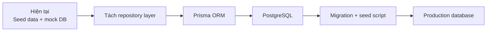

Trong phạm vi subproject giao diện, seed/mock DB giúp demo đầy đủ luồng nghiệp vụ mà không cần vận hành database riêng. Khi mở rộng, lớp API hiện tại là điểm thay thế hợp lý để kết nối Prisma/PostgreSQL.

---

## 5. Luồng dữ liệu và nghiệp vụ

### 5.1 Luồng đăng nhập

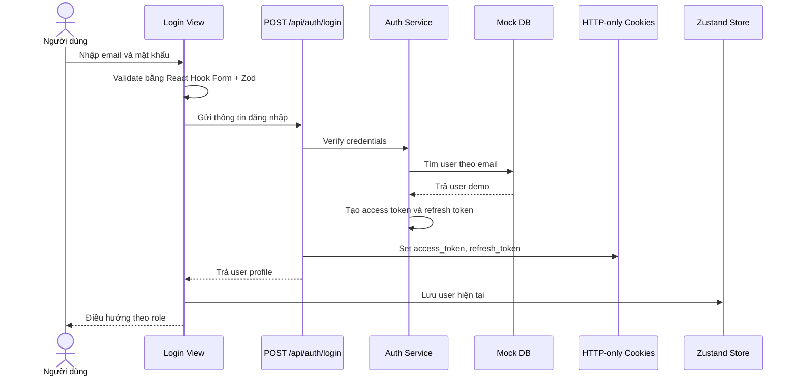

### 5.2 Luồng refresh token / re-login

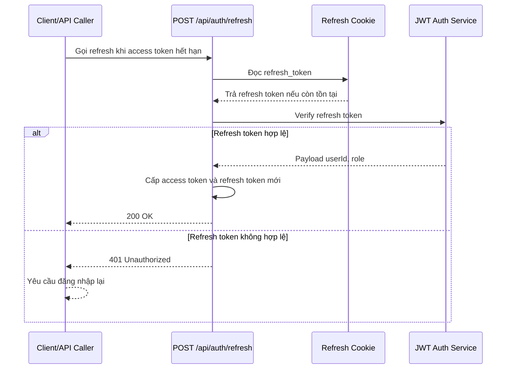

### 5.3 Luồng bảo vệ route admin

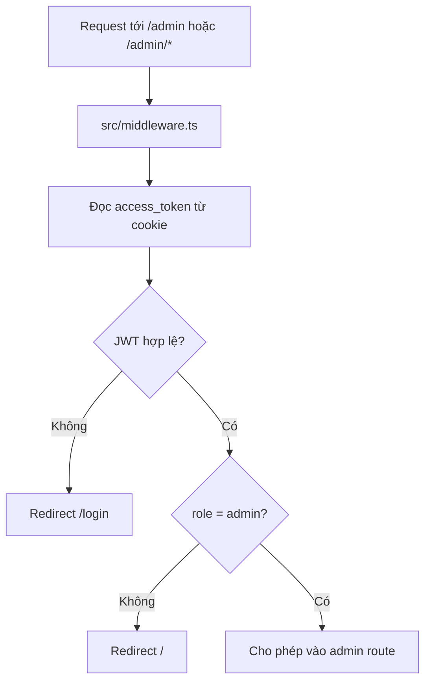

### 5.4 Luồng tìm kiếm, lọc và phân trang sản phẩm

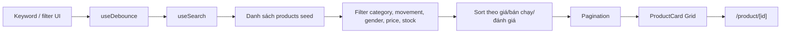

### 5.5 Luồng checkout

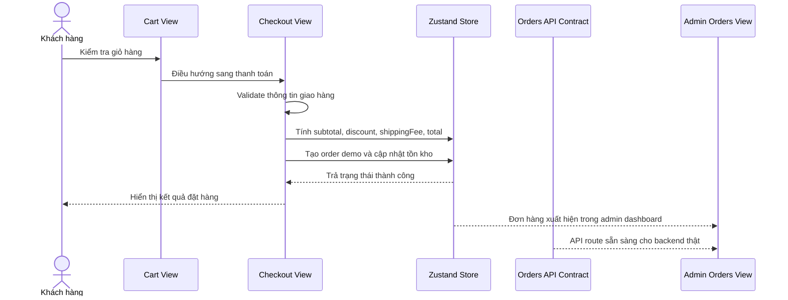

### 5.6 Luồng CRUD admin

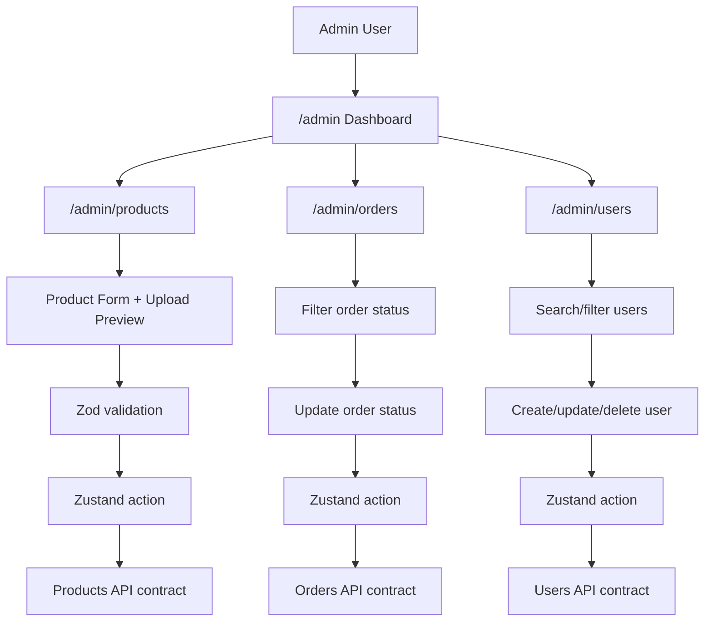

### 5.7 Luồng AI hỗ trợ bán hàng

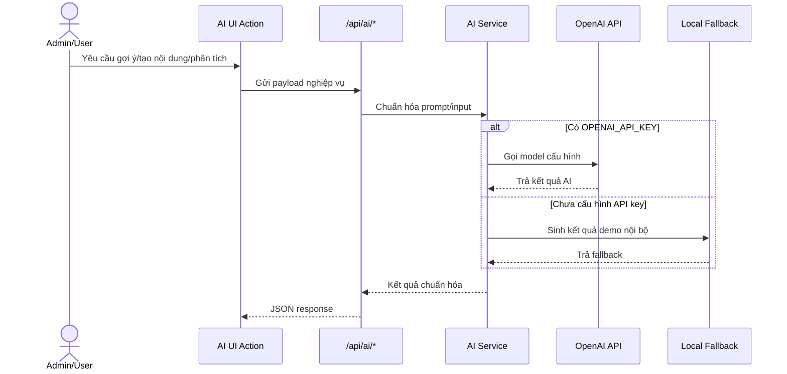

---

## 6. Các chức năng chính

### 6.1 Auth và phân quyền

- Đăng ký, đăng nhập, đăng xuất.
- Access token và refresh token lưu bằng HTTP-only cookies.
- Middleware kiểm tra JWT và role trước khi vào `/admin/*`.
- Có endpoint `/api/auth/refresh` để cấp lại token; nếu refresh token không hợp lệ thì chuyển sang re-login flow.
- Custom hook `useAuth` hỗ trợ UI truy cập user hiện tại.

### 6.2 Products module

- Danh sách sản phẩm theo category và filter.
- Chi tiết sản phẩm tại `/product/[id]` có `generateStaticParams`, ISR và dynamic metadata.
- Admin CRUD sản phẩm: thêm, sửa, xóa, tìm kiếm.
- Upload ảnh sản phẩm có preview và validate định dạng/kích thước.
- API contract:
  - `GET /api/products`
  - `POST /api/products`
  - `GET /api/products/:id`
  - `PATCH /api/products/:id`
  - `DELETE /api/products/:id`

### 6.3 Orders module

- Checkout tạo đơn hàng demo.
- Admin xem danh sách đơn hàng, lọc theo trạng thái, cập nhật trạng thái.
- User xem đơn hàng của mình qua route profile/API contract.
- API contract:
  - `GET /api/orders`
  - `POST /api/orders`
  - `GET /api/orders/me`
  - `PATCH /api/orders/:id/status`

### 6.4 Users module

- Admin xem danh sách người dùng.
- Tìm kiếm, tạo, cập nhật, xóa user demo.
- Phân biệt role `admin` và `user`.
- API contract:
  - `GET /api/users`
  - `POST /api/users`
  - `PATCH /api/users/:id`
  - `DELETE /api/users/:id`

### 6.5 Search, filter và pagination

- Search theo keyword qua `SearchBar` và `useSearch`.
- Debounce input bằng `useDebounce`.
- Filter theo danh mục, giá, bộ máy, giới tính, tồn kho.
- Sort theo giá, bán chạy hoặc đánh giá.
- Pagination trong trang shop để danh sách không render quá dài.

### 6.6 Dashboard và báo cáo

- Tổng doanh thu.
- Tổng đơn hàng.
- Tổng khách hàng.
- Sản phẩm tồn kho thấp.
- Biểu đồ doanh thu bằng Recharts.
- AI insights route hỗ trợ phân tích số liệu dashboard khi cấu hình API key.

### 6.7 SEO

- Root metadata trong `src/app/layout.tsx`.
- Metadata riêng cho các page chính.
- Dynamic metadata cho product detail.
- Canonical URL và Open Graph.
- Sitemap tại `/sitemap.xml`.

---

## 7. Cấu trúc thư mục dự án

### 7.1 Sơ đồ tổ chức thư mục

```mermaid
flowchart TB
  repo["casio-vn-store"] --> src["src"]
  repo --> docs["docs"]
  repo --> config["config files"]

  src --> app["app<br/>Next.js routes + API"]
  src --> views["views<br/>Page-level UI"]
  src --> components["components<br/>Layout/common UI"]
  src --> features["features<br/>Domain UI modules"]
  src --> hooks["hooks<br/>Reusable React hooks"]
  src --> lib["lib<br/>Client/server utilities"]
  src --> store["store<br/>Zustand state"]
  src --> data["data<br/>Seed data"]
  src --> schemas["schemas<br/>Zod schemas"]
  src --> types["types<br/>TypeScript types"]
  src --> tests["__tests__<br/>Unit + integration"]

  app --> appPages["page.tsx files"]
  app --> api["api/* route handlers"]
  app --> sitemap["sitemap.ts"]
  app --> middlewareRef["middleware via src/middleware.ts"]

  features --> productFeature["products"]
  features --> searchFeature["search"]
  features --> adminFeature["admin"]

  lib --> clientApi["client-api.ts"]
  lib --> serverLib["server/*"]

  docs --> report["bao-cao-du-an.md"]
  docs --> apiDoc["api.md"]
  docs --> archDoc["architecture.md"]
  docs --> schemaDoc["schema.md"]
  docs --> sprintDocs["sprints/*"]

  config --> nextConfig["next.config.ts"]
  config --> eslint["eslint.config.js"]
  config --> jest["jest.config.cjs"]
  config --> tsconfig["tsconfig.json"]
```

### 7.2 Cây thư mục chi tiết

```txt
casio-vn-store/
├── docs/
│   ├── api.md
│   ├── architecture.md
│   ├── bao-cao-du-an.md
│   ├── schema.md
│   └── sprints/
├── src/
│   ├── app/
│   │   ├── api/
│   │   │   ├── ai/
│   │   │   ├── auth/
│   │   │   ├── orders/
│   │   │   ├── products/
│   │   │   └── users/
│   │   ├── admin/
│   │   ├── cart/
│   │   ├── checkout/
│   │   ├── login/
│   │   ├── product/[id]/
│   │   ├── profile/
│   │   ├── register/
│   │   ├── shop/
│   │   ├── wishlist/
│   │   ├── layout.tsx
│   │   ├── page.tsx
│   │   └── sitemap.ts
│   ├── components/
│   │   ├── common/
│   │   └── layout/
│   ├── data/
│   │   ├── products.ts
│   │   └── seed.ts
│   ├── features/
│   │   ├── admin/
│   │   ├── products/
│   │   └── search/
│   ├── hooks/
│   │   ├── useAuth.ts
│   │   ├── useCart.ts
│   │   ├── useDebounce.ts
│   │   └── useSearch.ts
│   ├── lib/
│   │   ├── server/
│   │   │   ├── ai.ts
│   │   │   ├── auth.ts
│   │   │   ├── mock-db.ts
│   │   │   └── responses.ts
│   │   ├── ai.ts
│   │   ├── cart.ts
│   │   ├── client-api.ts
│   │   ├── navigation.tsx
│   │   └── query-provider.tsx
│   ├── schemas/
│   │   ├── admin.ts
│   │   └── auth.ts
│   ├── store/
│   │   └── useStore.ts
│   ├── styles/
│   │   └── index.css
│   ├── types/
│   │   ├── ai.ts
│   │   └── index.ts
│   ├── views/
│   │   ├── admin/
│   │   ├── Cart.tsx
│   │   ├── Checkout.tsx
│   │   ├── Home.tsx
│   │   ├── Login.tsx
│   │   ├── ProductDetail.tsx
│   │   ├── Profile.tsx
│   │   ├── Register.tsx
│   │   └── Shop.tsx
│   ├── __tests__/
│   │   ├── components/
│   │   ├── flows/
│   │   ├── hooks/
│   │   └── pages/
│   └── middleware.ts
├── .github/workflows/
├── .husky/
├── package.json
├── next.config.ts
├── tsconfig.json
└── README.md
```

### 7.3 Quy ước tổ chức code

- `app/`: chỉ chứa route, layout, metadata và API Route Handler.
- `views/`: màn hình lớn dùng bởi route trong `app/`.
- `features/`: component theo nghiệp vụ, ví dụ products/search/admin.
- `components/`: layout/common component dùng chung.
- `lib/server/`: logic backend chỉ chạy phía server.
- `hooks/`: custom hook tái sử dụng.
- `schemas/`: Zod schema cho validation.
- `types/`: type dùng chung giữa UI, store và API.
- `__tests__/`: test tách theo hooks, components, pages, flows.

---

## 8. Bảo mật và phân quyền

### 8.1 Sơ đồ bảo mật

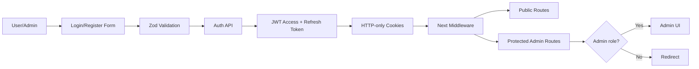

### 8.2 Cơ chế xác thực

- Token được ký bằng `AUTH_SECRET`.
- Access token dùng cho request ngắn hạn.
- Refresh token dùng để cấp lại access token.
- Cookie đặt theo hướng HTTP-only để giảm rủi ro đọc token từ JavaScript.
- API trả lỗi theo format thống nhất để UI dễ xử lý.

### 8.3 Cơ chế phân quyền

| Role    | Quyền chính                                                        |
| ------- | ------------------------------------------------------------------ |
| `user`  | Xem sản phẩm, search/filter, giỏ hàng, wishlist, checkout, profile |
| `admin` | Toàn bộ quyền user, thêm dashboard và CRUD products/orders/users   |

### 8.4 Validate và error handling

- Login/register dùng React Hook Form kết hợp Zod.
- API auth validate payload trước khi xử lý.
- Product form validate thông tin cơ bản trước khi cập nhật store/API contract.
- Response API được chuẩn hóa:

```json
{
  "success": true,
  "data": {}
}
```

```json
{
  "success": false,
  "message": "Validation failed",
  "errors": [{ "field": "email", "message": "Email không hợp lệ" }]
}
```

### 8.5 Giới hạn hiện tại

Vì đây là subproject tập trung vào giao diện, dữ liệu hiện đang dùng seed/mock DB. Khi đưa vào production thật, cần bổ sung database bền vững, password hashing thật, server-side authorization cho từng mutation admin và audit log cho thao tác quản trị.

---

## 9. Kiểm thử, CI/CD và triển khai

### 9.1 Mô hình kiểm thử

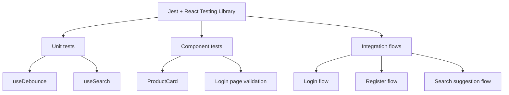

### 9.2 Test coverage hiện tại

| Nhóm test        | File tiêu biểu                                    | Nội dung kiểm thử                                |
| ---------------- | ------------------------------------------------- | ------------------------------------------------ |
| Hook unit test   | `src/__tests__/hooks/useDebounce.test.ts`         | Debounce value, reset timer                      |
| Hook unit test   | `src/__tests__/hooks/useSearch.test.ts`           | Search theo name/category                        |
| Component test   | `src/__tests__/components/ProductCard.test.tsx`   | Render name/category/image/link                  |
| Page test        | `src/__tests__/pages/Login.test.tsx`              | Form login, validate email/password, link signup |
| Integration flow | `src/__tests__/flows/AuthAndSearchFlows.test.tsx` | Login, register, search suggestion               |

Tổng số test đã kiểm tra: **16 tests**.

### 9.3 Pipeline CI/CD

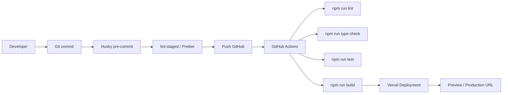

### 9.4 Script vận hành

```bash
npm install
cp .env.example .env.local
npm run dev
```

```bash
npm run lint
npm run type-check
npm run test
npm run build
```

### 9.5 Biến môi trường

| Biến                   | Mục đích                                         |
| ---------------------- | ------------------------------------------------ |
| `NEXT_PUBLIC_SITE_URL` | URL site dùng cho metadata, canonical và sitemap |
| `AUTH_SECRET`          | Secret ký JWT access/refresh token               |
| `OPENAI_API_KEY`       | Tùy chọn, dùng cho AI routes                     |
| `OPENAI_MODEL`         | Tùy chọn, model AI khi gọi OpenAI                |

### 9.6 Triển khai

Repo đã deploy trên **Vercel**. Quy trình vận hành sau khi chỉnh sửa:

1. Commit code lên Git.
2. Push lên branch deploy.
3. Vercel tự chạy build bằng `next build`.
4. Nếu build thành công, production/preview deployment được cập nhật.

---

## 10. Đối chiếu yêu cầu và tổng kết

### 10.1 Đối chiếu yêu cầu đề gốc

| Yêu cầu                                     | Trạng thái | Minh chứng trong dự án                                     |
| ------------------------------------------- | ---------- | ---------------------------------------------------------- |
| Migrate từ Vite SPA sang Next.js App Router | Đã làm     | `src/app/*`, `next.config.ts`, scripts Next.js             |
| Route chính trong `app/`                    | Đã làm     | `/`, `/shop`, `/product/[id]`, `/admin/*`, `/api/*`        |
| Metadata per page                           | Đã làm     | `layout.tsx`, page metadata, product dynamic metadata      |
| Ít nhất 1 trang SSR                         | Đã làm     | `/admin/*`, `/profile`, `/checkout` dynamic routes         |
| Ít nhất 1 trang SSG/ISR                     | Đã làm     | `/product/[id]` với `generateStaticParams`, `revalidate`   |
| API Routes cho auth/products/orders/users   | Đã làm     | `src/app/api/auth`, `products`, `orders`, `users`          |
| JWT/refresh token hoặc re-login flow        | Đã làm     | `jose`, HTTP-only cookies, `/api/auth/refresh`             |
| CRUD tối thiểu 3 module                     | Đã làm     | Products, Orders, Users                                    |
| Search/filter/pagination                    | Đã làm     | `Shop`, `SearchBar`, `useSearch`, filter UI                |
| Dashboard/báo cáo                           | Đã làm     | `src/views/admin/Dashboard.tsx`, Recharts                  |
| Upload ảnh + preview + validate             | Đã làm     | `UploadImage.tsx`, admin product form                      |
| Global state                                | Đã làm     | Zustand store                                              |
| Custom hooks                                | Đã làm     | `useAuth`, `useCart`, `useDebounce`, `useSearch`           |
| Form validation                             | Đã làm     | React Hook Form + Zod                                      |
| Testing 10-15 unit và 3-5 integration       | Đã đạt     | 16 tests, gồm hook/component/page/integration flows        |
| CI/CD và deploy                             | Đã làm     | GitHub Actions, Vercel                                     |
| Tài liệu                                    | Đã làm     | `README.md`, `docs/api.md`, `docs/architecture.md`, report |

### 10.2 Điểm mạnh của dự án

- Kiến trúc Next.js App Router rõ ràng, tách route/API/UI/store theo trách nhiệm.
- Có đủ luồng thương mại điện tử quan trọng: catalog, search/filter, cart, checkout, wishlist, admin.
- Có auth custom JWT với access/refresh token và middleware bảo vệ route admin.
- Có metadata, sitemap, SSR/SSG/ISR để đáp ứng yêu cầu Next.js.
- Có test cho hooks, component, page và integration flows.
- Có API contract sẵn để thay mock DB bằng database thật trong tương lai.

### 10.3 Hạn chế và hướng phát triển

- Seed/mock DB chưa phải database bền vững.
- Chưa có password hashing production-grade vì tài khoản đang phục vụ demo.
- Chưa có E2E test bằng Playwright/Cypress.
- CRUD UI hiện ưu tiên demo mượt bằng Zustand; khi production nên đồng bộ trực tiếp với API/database.
- Cần bổ sung logging/audit trail cho thao tác admin nếu triển khai thật.

### 10.4 Kết luận

Casio VN Store đã được nâng cấp từ SPA sang web app Next.js có cấu trúc full-stack nhẹ, đáp ứng trọng tâm của subproject: giao diện React, App Router, render strategy, API Routes, auth, phân quyền, CRUD, dashboard, upload, testing, CI/CD và tài liệu. Dự án có thể chạy local, build production và redeploy trên Vercel sau mỗi lần push Git.

---

_Tài liệu được biên soạn cho mục đích báo cáo dự án môn Phát triển giao diện ứng dụng._
